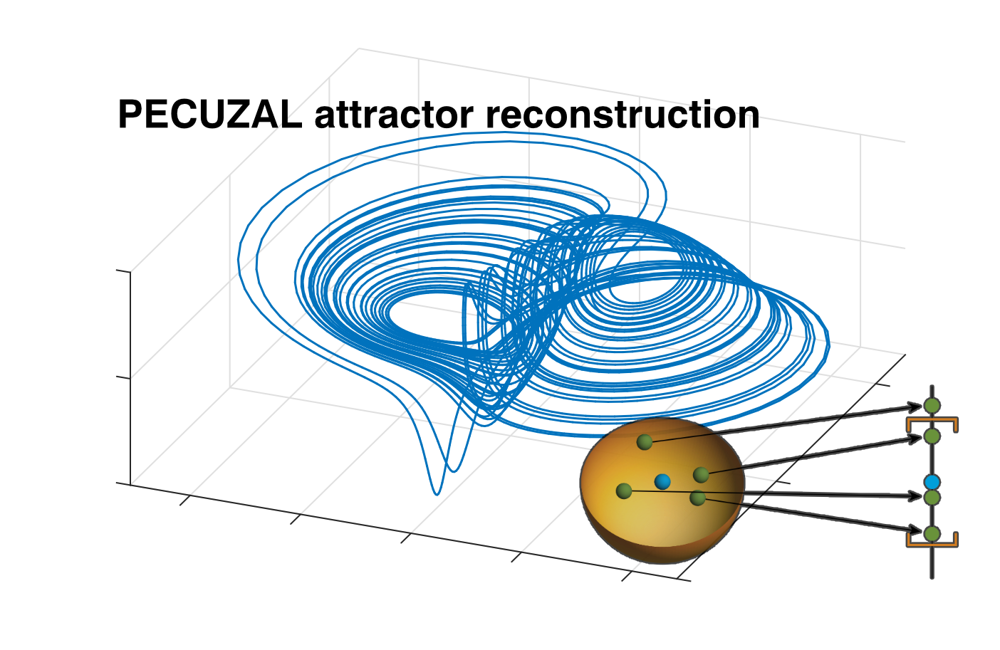

.. image:: https://travis-ci.org/hkraemer/PECUZAL_python.svg?branch=main
    :target: https://travis-ci.org/hkraemer/PECUZAL_python

.. image:: https://img.shields.io/badge/docs-dev-blue.svg
    :target: https://hkraemer.github.io/PECUZAL_python/
    
.. image:: https://zenodo.org/badge/312547816.svg
   :target: https://zenodo.org/badge/latestdoi/312547816

PECUZAL Python
==============

We introduce the PECUZAL automatic embedding of time series method for Python. It is solely based
on the paper [kraemer2021]_ `(Open Source) <https://iopscience.iop.org/article/10.1088/1367-2630/abe336>`_, where the functionality is explained in detail. Here we
give an introduction to its easy usage in three examples. Enjoy Embedding! 

Getting started
===============

Install from `PyPI <https://pypi.org/project/pecuzal-embedding/>`_ by simply typing

::

   pip install pecuzal-embedding

in your console.

NOTE
====

This implementation is not profiled well. We recommend to use the implementation
in the `Julia language <https://juliadynamics.github.io/DynamicalSystems.jl/latest/embedding/unified/>`_ or 
in `Matlab <https://github.com/hkraemer/PECUZAL_Matlab>`_,
in order to get fast results, especially in the multivariate case. Moreover,
it is well documented and embedded in the 
`DynamicalSystems.jl <https://juliadynamics.github.io/DynamicalSystems.jl/dev/>`_ ecosystem.
For instance, the compuations made in the `Univariate example <https://hkraemer.github.io/PECUZAL_python/univariate_example.html>`_ 
and the `Multivariate example <https://hkraemer.github.io/PECUZAL_python/multivariate_example.html>`_
in this documentation took approximately `800s` (approx. 13 mins) and `4700s` (approx. 1 hour and 10 mins!), respectively, even when
using the `econ` option in the function call, for an accelerated computation. In the Julia implementation
the exact same computation took `4s` and `25s`, respectively! (running on a 2.8GHz Quad-Core i7,  16GB 1600 MHz DDR3)

Documentation
=============

There is a `documentation available <https://hkraemer.github.io/PECUZAL_python/>`_ including some basic usage examples.

Citing and reference
====================
If you enjoy this tool and find it valuable for your research please cite

.. [kraemer2021] Kraemer et al., "A unified and automated approach to attractor reconstruction", New Journal of Physics 23(3), 033017,  `10.1088/1367-2630/abe336 <https://iopscience.iop.org/article/10.1088/1367-2630/abe336>`_, 2021.

or as BiBTeX-entry:

::

    @article{Kraemer2021,
        doi = {10.1088/1367-2630/abe336},
        url = {https://doi.org/10.1088/1367-2630/abe336},
        year = 2021,
        month = {mar},
        publisher = {{IOP} Publishing},
        volume = {23},
        number = {3},
        pages = {033017},
        author = {K H Kraemer and G Datseris and J Kurths and I Z Kiss and J L Ocampo-Espindola and N Marwan},
        title = {A unified and automated approach to attractor reconstruction},
        journal = {New Journal of Physics},
        abstract = {We present a fully automated method for the optimal state space reconstruction from univariate and multivariate time series. The proposed methodology generalizes the time delay embedding procedure by unifying two promising ideas in a symbiotic fashion. Using non-uniform delays allows the successful reconstruction of systems inheriting different time scales. In contrast to the established methods, the minimization of an appropriate cost function determines the embedding dimension without using a threshold parameter. Moreover, the method is capable of detecting stochastic time series and, thus, can handle noise contaminated input without adjusting parameters. The superiority of the proposed method is shown on some paradigmatic models and experimental data from chaotic chemical oscillators.}
    }

Licence
=======
This is program is free software and runs under `MIT Licence <https://opensource.org/licenses/MIT>`_.