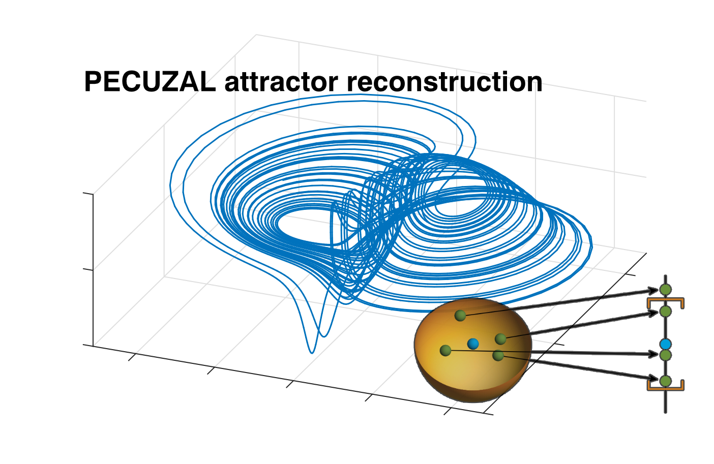

.. PECUZAL automatic embedding for Python documentation master file, created by
   sphinx-quickstart on Wed Nov  4 15:35:18 2020.
   You can adapt this file completely to your liking, but it should at least
   contain the root `toctree` directive.

Welcome to PECUZAL automatic embedding for Python's documentation!
==================================================================

.. image:: https://travis-ci.org/hkraemer/PECUZAL_python.svg?branch=main
    :target: https://travis-ci.org/hkraemer/PECUZAL_python

.. image:: https://img.shields.io/badge/docs-dev-blue.svg
    :target: https://hkraemer.github.io/PECUZAL_python/

.. image:: https://zenodo.org/badge/312547816.svg
   :target: https://zenodo.org/badge/latestdoi/312547816

We introduce the PECUZAL automatic embedding of time series method for Python. It is solely based
on the paper [kraemer2020]_ `(Open Source) <https://arxiv.org/abs/2011.07040>`_, where the functionality is explained in detail. Here we
give an introduction to its easy usage in three examples. Enjoy Embedding! 

.. todo::
   * Insert correct citation link at the end of the page

Getting started
===============

Install from `PyPI <https://pypi.org/project/pecuzal-embedding/>`_ by simply typing

::

   pip install pecuzal-embedding

in your console.

.. note::
   :name: note_performance

   This implementation is not profiled well. We recommend to use the implementation
   in the `Julia language <https://juliadynamics.github.io/DynamicalSystems.jl/latest/embedding/unified/>`_ or 
   in `Matlab <https://github.com/hkraemer/PECUZAL_Matlab>`_,
   in order to get fast results, especially in the multivariate case. Moreover,
   it is well documented and embedded in the 
   `DynamicalSystems.jl <https://juliadynamics.github.io/DynamicalSystems.jl/dev/>`_ ecosystem.
   For instance, the compuations made in the :ref:`sec_univariate` and the :ref:`sec_multivariate`
   in this documentation took approximately `800s` (approx. 13 mins.) and `4700s` (approx. 1 hour and 10 mins!), respectively, 
   even when using the `econ` option in the function call, which accelerates the computation time. In the Julia implementation
   the exact same computation took `4s` and `25s`, respectively! (running on a 2.8GHz Quad-Core i7,  16GB 1600 MHz DDR3)

.. toctree::
   :maxdepth: 1
   :caption: Usage and examples

   Embedding of a univariate time series <univariate_example>
   Embedding of multivariate time series <multivariate_example>
   Embedding of non-deterministic data <noise_example>

.. toctree::
   :maxdepth: 1
   :caption: Source functions

   pecuzal_embedding

Citing and reference
====================
If you enjoy this tool and find it valuable for your research please cite

.. [kraemer2020] Kraemer et al., "A unified and automated approach to attractor reconstruction",  `arXiv:2011.07040 [physics.data-an] <https://arxiv.org/abs/2011.07040>`_, 2020.

or as BiBTeX-entry:

::

   @misc{kraemer2020,
   title={A unified and automated approach to attractor reconstruction}, 
   author={K. H. Kraemer and G. Datseris and J. Kurths and I. Z. Kiss and J. L. Ocampo-Espindola and N. Marwan},
   year={2020},
   eprint={2011.07040},
   archivePrefix={arXiv},
   primaryClass={physics.data-an}
   url={https://arxiv.org/abs/2011.07040}
   }

Licence
=======
This is program is free software and runs under `MIT Licence <https://opensource.org/licenses/MIT>`_.

Indices and tables
==================

* :ref:`genindex`
* :ref:`modindex`
* :ref:`search`
