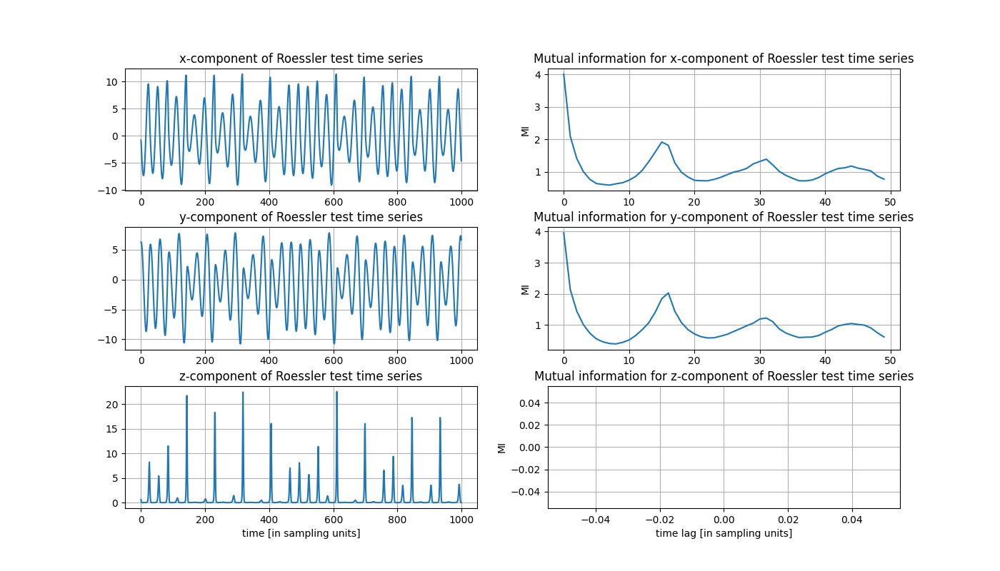

.. _sec_multivariate:

Multivariate example
====================

If you want to run the following example on your local machine, you are welcome to download the code
`here <https://github.com/hkraemer/PECUZAL_python/blob/docs-config/docs/compute_documentation_examples.py>`_ 
and run it (after having pip-installed pecuzal-embedding and matplotlib packages).

Similar to the approach in the :ref:`sec_univariate`, we now highlight the capability of the
proposed embedding method for a multivariate input. Again, we define and integrate the
ODE's and restrict ourselves to the first 2,500 samples, in order to save computation time.

.. code-block:: python
   
    import numpy as np
    from scipy.integrate import odeint

    # integrate Roessler system on standard parameters
    def roessler(x,t):
        return [-x[1]-x[2], x[0]+.2*x[1], .2+x[2]*(x[0]-5.7)]

    x0 = [1., .5, .5] # define initial conditions
    tspan = np.arange(0., 5000.*.2, .2) # time span
    data = odeint(roessler, x0, tspan, hmax = 0.01)

    data = data[2500:,:]    # remove transients

The idea is now to feed in all three time series to the algorithm, even though this is a very
far-from-reality example. We already have an adequate representation of the system we want to
reconstruct, namely the three time series from the numerical integration. But let us see what
PECUZAL suggests for a reconstruction.

Since we have to deal with three time series now, let us estimate the Theiler window as the
maximum of all Theiler windows of each time series. Again, we estimate such a Theiler window
by taking the first minimum of the auto mutual information.

.. code-block:: python
   
   import matplotlib.pyplot as plt
   from pecuzal_embedding import pecuzal_embedding, mi

   N = len(data)
   mis = np.empty(shape=(50,3))
   for i in range(3):
      mis[:,i], lags = mi(data[:,i])    # compute mutual information up to default maximum time lag

   plt.figure(figsize=(14., 8,))

   ts_str = ['x','y','z']

   cnt = 0
   for i in range(0,6,2):
      plt.subplot(3,2,i+1)
      plt.plot(range(1000),data[:1000,cnt])
      plt.grid()
      if i == 4:
         plt.xlabel('time [in sampling units]')
      plt.title(ts_str[cnt]+'-component of Roessler test time series')

      plt.subplot(3,2,i+2)
      plt.plot(lags,mis[:,cnt])
      plt.grid()
      plt.ylabel('MI')
      if i == 4:
         plt.xlabel('time lag [in sampling units]')
      plt.title('Mutual information for '+ts_str[cnt]+'-component of Roessler test time series')
      cnt +=1
   plt.subplots_adjust(hspace=.3)
   plt.savefig('mi_and_timeseries_multi.png')

.. _fig_mi_multi:

Due to the spikyness of the `z`-component the according auto mutual information yields `nan`-values as
a result of empty bins in the histograms. So we stick to the choice of `theiler = 7` here and 
call the PECUZAL algorithm :py:func:`pecuzal_embedding.pecuzal_embedding` with default `kwargs` 
and possible delays ranging from `0:100`.
**NOTE: The following computation will take approximately 120 minutes (depending on the machine you are running the code on).
See also the :ref:`performance note <note_performance>`.**

.. code-block:: python

   Y_reconstruct, tau_vals, ts_vals, Ls, eps = pecuzal_embedding(data, taus = range(100), theiler = 7)

which leads to the following note in the console:

::

   Algorithm stopped due to increasing L-values. VALID embedding achieved.

The suggested embedding parameters...

::

   tau_vals = [0, 0, 3]
   ts_vals = [1, 0, 0]

... reveal that PECUZAL builds the reconstructed trajectory `Y_reconstruct` from the unlagged time series, having
index `0`, i.e. the `y`-component and the `x`-component without lag, and finally again the `x`-component lagged
by 3 samples. As expected the total :math:`\Delta L`-value is smaller here than in the :ref:`univariate case <l_uni>`:

.. code-block:: python

   L_total = np.sum(Ls[:-1])

   -1.6242891455616424

The reconstructed attractor looks also quite similar to the original one, even though that is not a proper evaluation
criterion for the goodness of a reconstruction, see [kraemer2020]_.

.. code-block:: python
   
   from mpl_toolkits import mplot3d
   
   ts_labels = ['x','y','z']

   fig = plt.figure(figsize=(14., 8.))
   ax = plt.subplot(121, projection='3d')
   ax.plot(Y_reconstruct[:,0], Y_reconstruct[:,1], Y_reconstruct[:,2], 'gray')
   ax.grid()
   ax.set_xlabel('{}(t+{})'.format(ts_labels[ts_vals[0]],tau_vals[0]))
   ax.set_ylabel('{}(t+{})'.format(ts_labels[ts_vals[1]],tau_vals[1]))
   ax.set_zlabel('{}(t+{})'.format(ts_labels[ts_vals[2]],tau_vals[2]))
   ax.set_title('PECUZAL reconstructed Roessler system (multivariate)')
   ax.view_init(-115, 30)

   ax = plt.subplot(122, projection='3d')
   ax.plot(data[:5000,0], data[:5000,1], data[:5000,2], 'gray')
   ax.grid()
   ax.set_xlabel('x(t)')
   ax.set_ylabel('y(t)')
   ax.set_zlabel('z(t)')
   ax.set_title('Original Roessler system')

.. _fig_rec_multi:

.. image:: ./docsource/images/reconstruction_multi.png

