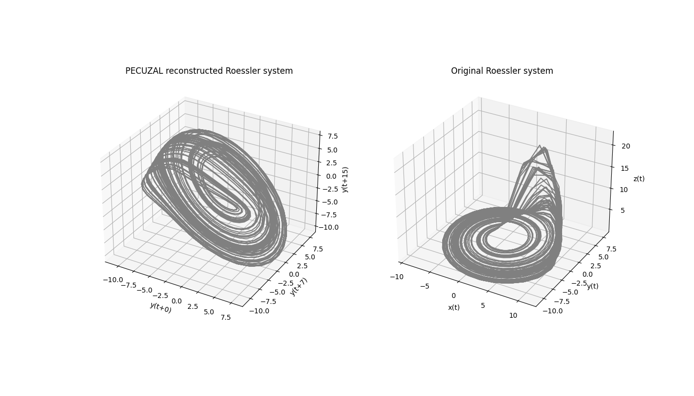
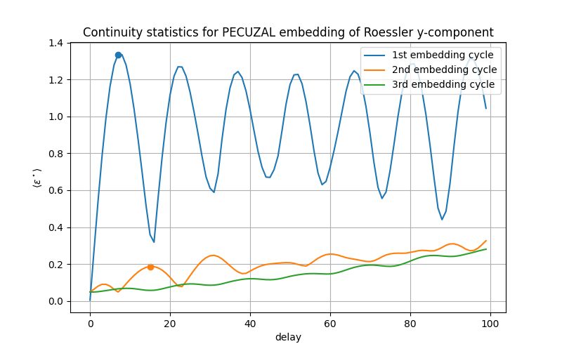

.. _sec_univariate:

Univariate example
==================

If you want to run the following example on your local machine, you are welcome to download the code
`here <https://github.com/hkraemer/PECUZAL_python/blob/docs-config/docs/compute_documentation_examples.py>`_ 
and run it (after having pip-installed pecuzal-embedding and matplotlib packages).

We exemplify the proposed embedding method by embedding the `y`-component of the Roessler system
(with standard parameters :math:`[a = 0.2, b = 0.2, c = 5.7]`). Therefore we define and integrate the
ODE's:

.. code-block:: python
   
    import numpy as np
    from scipy.integrate import odeint

    # integrate Roessler system on standard parameters
    def roessler(x,t):
    return [-x[1]-x[2], x[0]+.2*x[1], .2+x[2]*(x[0]-5.7)]

    x0 = [1., .5, 0.5] # define initial conditions
    tspan = np.arange(0., 5000.*.2, .2) # time span
    data = odeint(roessler, x0, tspan, hmax = 0.01)

    data = data[2500:,:]    # remove transients

Now bind the time series we would like to consider and compute the auto mutual information, in order
to estimate an appropriate Theiler window. This is especially important when dealing with highly sampled
datasets. Let's focus on the first 2,500 samples here and plot the time series and its mutual information:

.. code-block:: python
   
    import matplotlib.pyplot as plt
    from pecuzal_embedding import pecuzal_embedding, mi

    y = data[:,1]   # bind only y-component
    muinf, lags = mi(y)    # compute mutual information up to default maximum time lag

    plt.figure(figsize=(6., 8,))
    plt.subplot(2,1,1)
    plt.plot(range(len(y[:1000])),y[:1000])
    plt.grid()
    plt.xlabel('time [in sampling units]')
    plt.title('y-component of Roessler test time series')

    plt.subplot(2,1,2)
    plt.plot(lags,muinf)
    plt.grid()
    plt.ylabel('MI')
    plt.xlabel('time lag [in sampling units]')
    plt.title('Mutual information for y-component of Roessler test time series')

    plt.subplots_adjust(hspace=.3)

.. _fig_mi_y:

Now we are ready to go and simply call the PECUZAL algorithm :py:func:`pecuzal_embedding.pecuzal_embedding` 
with a Theiler window determined from the first minimum of the mutual information shown in the above Figure 
and possible delays ranging from `0:100`. We will run the function with the `econ` option for faster computation.
**NOTE: The following computation will take approximately 13 minutes (depending on the machine you are running the code on).
See also the :ref:`performance note <note_performance>`.**

.. code-block:: python

    Y_reconstruct, tau_vals, ts_vals, Ls, eps = pecuzal_embedding(y, taus = range(100), theiler = 7, econ = True)

which leads to the following note in the console:

::

    Algorithm stopped due to increasing L-values. VALID embedding achieved.

`Y_reconstruct` stores the reconstructed trajectory. Since in this example `Y_reconstruct` is a three-dimensional
trajectory we can actually plot it, in order to visualize the result.

.. code-block:: python
   
    from mpl_toolkits import mplot3d
    
    fig = plt.figure(figsize=(14., 8.))
    ax = plt.subplot(121, projection='3d')
    ax.plot(Y_reconstruct[:,0], Y_reconstruct[:,1], Y_reconstruct[:,2], 'gray')
    ax.grid()
    ax.set_xlabel('y(t+{})'.format(tau_vals[0]))
    ax.set_ylabel('y(t+{})'.format(tau_vals[1]))
    ax.set_zlabel('y(t+{})'.format(tau_vals[2]))
    ax.set_title('PECUZAL reconstructed Roessler system')

    ax = plt.subplot(122, projection='3d')
    ax.plot(data[:5000,0], data[:5000,1], data[:5000,2], 'gray')
    ax.grid()
    ax.set_xlabel('x(t)')
    ax.set_ylabel('y(t)')
    ax.set_zlabel('z(t)')
    ax.set_title('Original Roessler system')

.. _fig_rec_y:

For the correct axis labels we used the delay values the PECUZAL algorithm used and which are
stored in the output-variable we named `tau_vals` above. 

::

    tau_vals = [0, 7, 15]

This means, that the reconstructed trajectory consists of the unlagged time series (here the 
`y`-component) and two more components with the time series lagged by 7 and 15 samples, respectively.
Note the coincidence with the first minimum of the mutual information...
The output variable `ts_vals` stores the chosen time series for each delay value stored in `tau_vals`. 
Since there is only one time series we fed in,

::

    ts_vals = [0, 0, 0]

This output is only needed for the multivariate case, see :ref:`sec_multivariate` . We can also
look at the output of the low-level function, namely the `continuity-statistic`, which led to
the result. We stored these statistics for each embedding cycle in the variable `eps`.

.. code-block:: python

    plt.figure(figsize=(8., 5.))
    plt.plot(eps[:,0], label='1st embedding cycle')
    plt.scatter([tau_vals[1]], [eps[tau_vals[1],0]])
    plt.plot(eps[:,1], label='2nd embedding cycle')
    plt.scatter([tau_vals[2]], [eps[tau_vals[2],1]])
    plt.plot(eps[:,2], label='3rd embedding cycle')
    plt.title('Continuity statistics for PECUZAL embedding of Roessler y-component')
    plt.xlabel('delay')
    plt.ylabel(r'$\langle \varepsilon^\star \rangle$')
    plt.legend(loc='upper right')
    plt.grid()

.. _fig_continuity_uni:

The points mark the postitions, where the algorithm picked the delays for the reconstruction from.
In the third embedding cycle there is no delay value picked and the algorithm breaks, because it
can not minimize the `L`-statistic further. Its values for each embedding cycle are stored in `Ls`:

.. code-block::
    :name: l_uni

    Ls = [-0.89078493296554, -0.6889087842665718]

Note that the very last value of the :math:`\Delta L` values corresponds to the last encountered embedding cycle, 
that led to a negative :math:`\Delta L`, i.e. in this case two embedding cycles had been run successful, resulting
in a three-dimensional embedding. The total deacrease in `L` is simply 

.. code-block::
    :name: l_uni_total

    L_total_uni = np.sum(Ls)

    -1.57968927756

